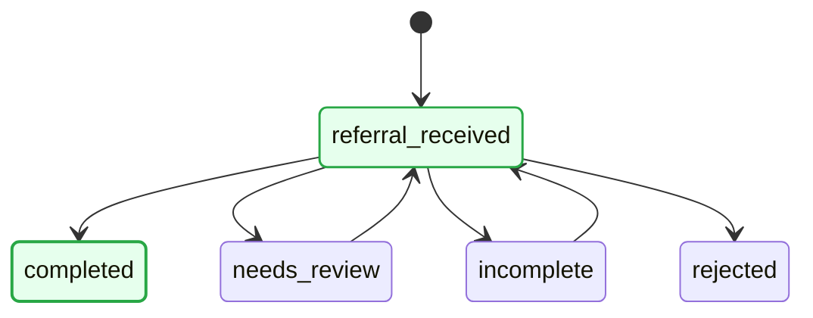
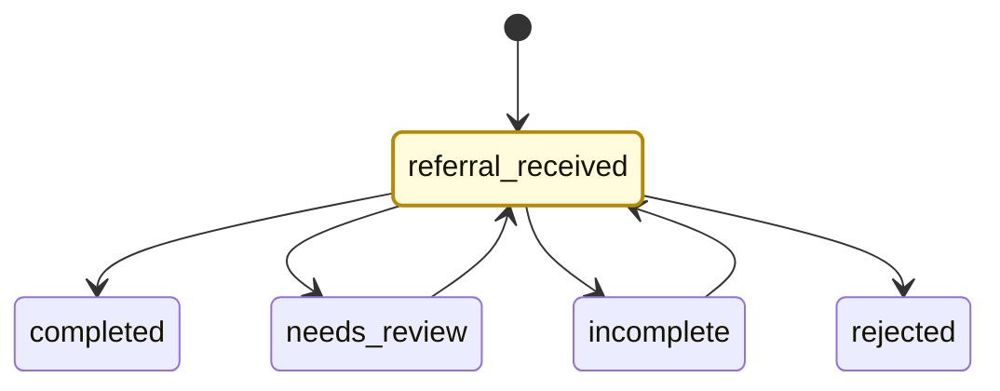
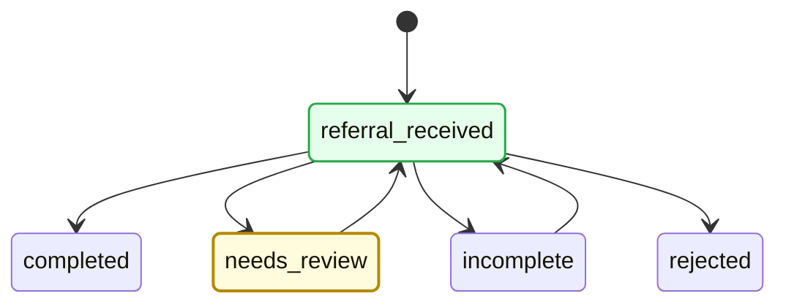
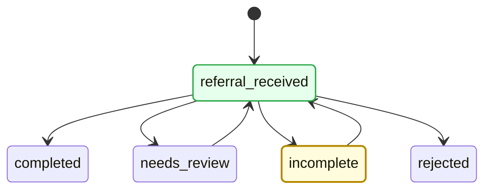
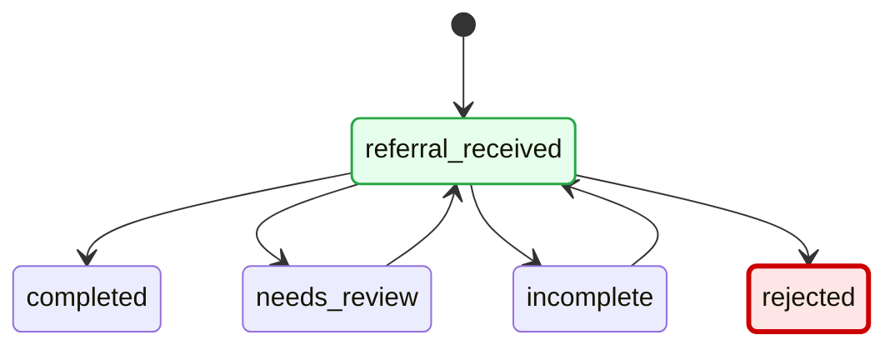

# Sample Mermaid Diagram - New Workflow Structure

## JSON Files for Frontend Integration

All Mermaid diagrams are available as JSON files in the `mermaid_diagrams/` directory for easy frontend integration. Each JSON file contains a `diagram` field with the Mermaid script as an escaped string.

**Available JSON Files:**
- `mermaid_diagrams/sample_diagram.json` - Base diagram
- `mermaid_diagrams/scenario_1_referral_received.json` - Current state: referral_received
- `mermaid_diagrams/scenario_2_completed.json` - Current state: completed
- `mermaid_diagrams/scenario_3_needs_review.json` - Current state: needs_review
- `mermaid_diagrams/scenario_4_incomplete.json` - Current state: incomplete
- `mermaid_diagrams/scenario_5_rejected.json` - Current state: rejected

## Workflow Structure

The new workflow starts with `referral_received` and routes to one of four states:
- `completed`
- `needs_review`
- `incomplete`
- `rejected`

## Sample Mermaid Diagram

**JSON File**: `mermaid_diagrams/sample_diagram.json`

## Example Scenarios

### Scenario 1: Current State is `referral_received`

**JSON File**: `mermaid_diagrams/scenario_1_referral_received.json`

### Scenario 2: Current State is `completed`

**JSON File**: `mermaid_diagrams/scenario_2_completed.json`

### Scenario 3: Current State is `needs_review`

**JSON File**: `mermaid_diagrams/scenario_3_needs_review.json`

### Scenario 4: Current State is `incomplete`

**JSON File**: `mermaid_diagrams/scenario_4_incomplete.json`

### Scenario 5: Current State is `rejected`

**JSON File**: `mermaid_diagrams/scenario_5_rejected.json`

## Color Coding

- **Green** (`#e6ffed`): Completed states (states that have been passed through)
- **Yellow** (`#fffbdd`): Current state (except rejected)
- **Red** (`#ffe6e6`): Rejected state (current state when rejected)

## State Descriptions

- **referral_received**: Initial state when a referral is first received
- **completed**: Referral has all required information and is complete
- **needs_review**: Referral requires manual review (can return to referral_received)
- **incomplete**: Referral is missing required information (can return to referral_received)
- **rejected**: Referral has been rejected (e.g., due to insurance issues)
