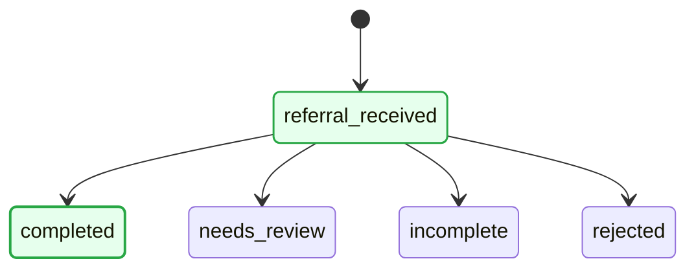

# Workflow Update Summary

## Changes Made

The workflow has been simplified from a complex linear flow to a simpler structure where `referral_received` routes directly to one of four states.

### Old Structure
- Started with `fax_received`
- Had multiple intermediate states: `extracting_information`, `missing_information`, `ready_for_assignment`, `assigned_to_care_team`
- Complex routing logic

### New Structure
- Starts with `referral_received`
- Routes directly to one of four states:
  1. `completed` - Referral is complete
  2. `needs_review` - Requires manual review
  3. `incomplete` - Missing required information
  4. `rejected` - Referral has been rejected

## Files Updated

1. **models.py**
   - Updated `ReferralState` type to include only the 5 new states
   - Changed default state from `fax_received` to `referral_received`

2. **state_machine.py**
   - Simplified state list to 5 states
   - Updated transitions to route from `referral_received` to the 4 destination states
   - Updated `_auto_advance` method with new routing mappings
   - Updated `execute_action` with new action mappings

3. **mermaid_generator.py**
   - Updated to generate diagram starting from `referral_received`
   - Updated styling logic for the new state structure
   - Green for completed states, yellow for current (except rejected), red for rejected

4. **api.py**
   - Updated demo patient data to use new states
   - Added a new demo patient (303) in `incomplete` state

5. **referral_rules.json**
   - Updated rules for `referral_received` state
   - Updated rules for `needs_review` and `incomplete` states
   - Simplified rule structure

## Sample Mermaid Diagram

The generated diagram will look like this:



## Testing the Changes

You can test the new workflow by:

1. Starting the server:
   ```bash
   cd NBA
   uvicorn referral_workflow.api:app --reload
   ```

2. Testing different referral states:
   - Patient 202: `referral_received` (initial state)
   - Patient 123: `completed`
   - Patient 456: `needs_review`
   - Patient 303: `incomplete`
   - Patient 789: `rejected`

3. Getting the Mermaid diagram:
   ```bash
   curl http://127.0.0.1:8000/referral/202/mermaid
   ```

## Next Steps

- The rules engine currently supports binary routing (success/failure). If you need more complex routing logic to determine which of the 4 states to route to, you may need to enhance the `WorkflowEngine.evaluate()` method.
- Consider adding more sophisticated rule evaluation for `referral_received` state to route to the appropriate state based on referral attributes.
